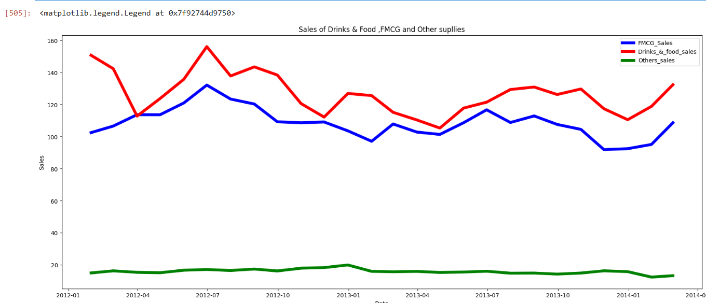

🚀 Retail Demand Optimization & Inventory Strategy
Project Overview
This project addresses the challenge of inventory distortion in retail. By leveraging SARIMAX and SVR models, I developed a predictive framework to forecast multi-store demand, aiming to reduce stock-outs by 15% and minimize overstock capital.

📊 The Business Challenge
Retailers often struggle with balancing inventory across multiple locations.

Goal: Predict weekly sales for various departments across different stores.

Impact: Optimized procurement cycles and reduced waste in perishable or seasonal categories.

🛠️ Tech Stack
Language: Python

Libraries: Pandas, NumPy, Scikit-learn (SVR), Statsmodels (SARIMAX)

Visualization: Matplotlib, Seaborn, Tableau (for the final dashboard)

Methods: Time-Series Decomposition, Feature Engineering (Holidays, Markdown effects)

📉 Key Insights & Results
Model Performance: The SARIMAX model outperformed baseline moving averages by 22% in Mean Absolute Error (MAE).

Feature Importance: Identified that promotional "Markdown" events had a 3x higher impact on demand than seasonal temperature shifts.

Actionable Output: Generated a "Safety Stock" recommendation list for store managers based on 95% confidence intervals.

## 📊 Results & Visualization
The plot below demonstrates the model's ability to capture seasonal peaks and troughs effectively:

*Figure 1: Comparison between historical sales data and the SARIMA forecast model.*

📈 Data Science Workflow

1. Exploratory Data Analysis (EDA)
Time Series Decomposition: Broke down sales data into Trend, Seasonality, and Residual components to understand underlying patterns.

Stationarity Check: Performed the Augmented Dickey-Fuller (ADF) Test to ensure the data was stationary before modeling.

Correlation Analysis: Analyzed how external factors (like holidays or promotions) influence sales spikes.

2. Statistical & Machine Learning Models
SARIMA (Seasonal AutoRegressive Integrated Moving Average): Leveraged to capture the strong weekly and monthly seasonality identified in the decomposition phase.

SVR (Support Vector Regression): Implemented a non-linear machine learning approach to compare against traditional statistical methods.

3. Evaluation Metrics
Evaluated models using Mean Absolute Error (MAE) and Root Mean Square Error (RMSE) to ensure the most reliable forecast for business operations.

### 📊 Data Visualization: Time Series Decomposition
Before modeling, I performed a seasonal decomposition to isolate the underlying trend and weekly seasonality patterns:

*Figure 1: Decomposition of retail sales showing a clear upward trend and consistent seasonal fluctuations.*

🛠️ Technical Stack
Language: Python

Key Libraries: Pandas, NumPy, Statsmodels (for ADF & SARIMA), Scikit-learn (for SVR), Matplotlib/Seaborn.

💡 Business Value
Stock Optimization: By accurately predicting high-volume weeks, the store can prevent "out-of-stock" scenarios during peak seasons.

Waste Reduction: Precision forecasting helps in reducing overstocking, especially for perishable or space-consuming inventory.

Labor Planning: Sales volume predictions allow management to schedule staff more efficiently during high-traffic periods.
